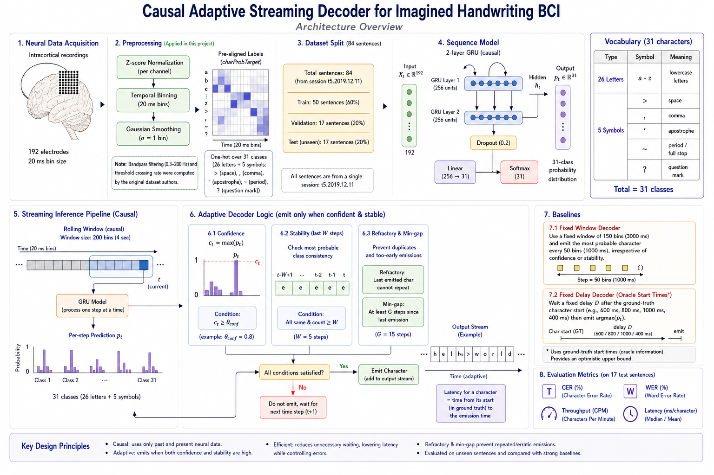
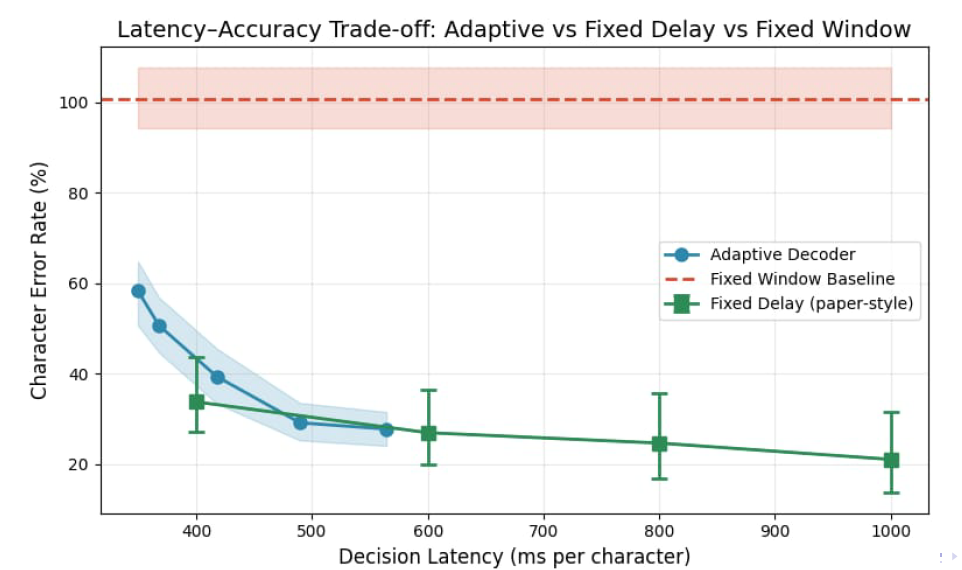
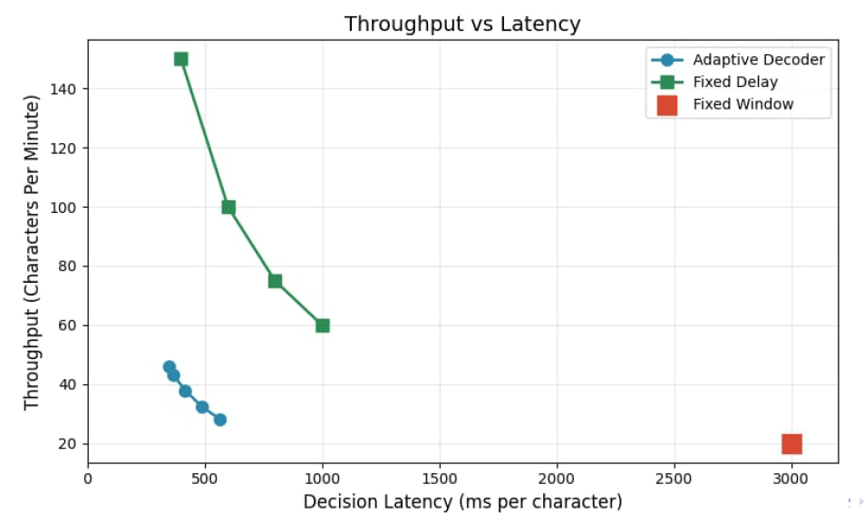

# Causal Adaptive Streaming Decoder for Imagined Handwriting BCIs

> A real-time Brain–Computer Interface (BCI) decoding system that transforms neural activity into text using a causal GRU-based streaming decoder with adaptive confidence-driven character emission.

---

## 📖 Overview

Brain–Computer Interfaces (BCIs) aim to restore communication abilities for individuals with severe motor impairments by decoding neural activity into text or actions.

The landmark work of **Willett et al. (Nature, 2021)** demonstrated that imagined handwriting can be decoded with remarkable accuracy and speed. However, their system relies on a **fixed decoding delay**, meaning the decoder waits a predetermined amount of time before producing each character regardless of signal quality.

This project investigates a different question:

> Can a handwriting BCI adaptively decide *when* to emit a character based on its confidence in the neural signal?

To address this, we developed a **Causal Adaptive Streaming Decoder** that continuously monitors model confidence and prediction stability, producing characters only when sufficient evidence has accumulated.

The result is a decoder that dynamically balances:

- Accuracy
- Latency
- Throughput

while operating in a fully causal streaming setting.

---

## 🎯 Project Goals

The primary objectives of this work were:

1. Build a causal neural decoder for imagined handwriting.
2. Develop an adaptive character-emission mechanism.
3. Compare adaptive decoding against fixed-window and fixed-delay baselines.
4. Quantify latency–accuracy trade-offs.
5. Investigate whether adaptive waiting can reduce unnecessary decoding delay.

---

# 🧠 Methodology

## Dataset

This project uses the publicly available imagined handwriting dataset introduced by:

> Willett et al., "High-performance brain-to-text communication via handwriting", Nature (2021)

### Data Characteristics

- Recording Session: `t5.2019.12.11`
- Neural Channels: 192 electrodes
- Temporal Resolution: 20 ms bins
- Vocabulary Size: 31 classes
- Total Sentences: 84

Dataset split:

| Split | Sentences |
|---------|---------:|
| Train | 50 |
| Validation | 17 |
| Test | 17 |

---

## Preprocessing Pipeline

The neural signals undergo several preprocessing stages:

1. Channel-wise Z-score normalization
2. Temporal binning (20 ms)
3. Gaussian smoothing (σ = 1 bin)
4. Construction of causal rolling windows

The labels are generated from the provided:

```text
charProbTarget
````

alignments supplied with the original dataset.

---

# 🏗 Model Architecture

The decoder is built using a lightweight causal recurrent architecture.

### Architecture

* Input: 192 neural channels
* Recurrent Layers: 2-layer GRU
* Hidden Dimension: 256
* Output Classes: 31
* Activation: Softmax
* Loss Function: Cross-Entropy

The model operates on rolling windows of neural activity and produces a probability distribution over characters at every timestep.

---

## Architecture Diagram

> Insert model architecture image here.





---

# ⚡ Adaptive Streaming Decoder

Unlike conventional systems that emit outputs after a fixed delay, our decoder continuously evaluates prediction quality.

At each timestep:

### Step 1 — Confidence

Compute:

$$
c_t = \max(p_t)
$$

where:

* $p_t$ is the predicted probability distribution
* $c_t$ is model confidence

---

### Step 2 — Stability

Check whether the predicted character remains unchanged for:

```text
W = 5
```

consecutive timesteps.

---

### Step 3 — Emission Rules

A character is emitted only if:

* Confidence exceeds threshold θ
* Prediction is stable
* Minimum gap constraint satisfied
* Refractory period satisfied

This prevents duplicate emissions while allowing rapid outputs when the model is confident.

---

# 🔬 Baselines

Two baseline systems were implemented.

---

## Baseline 1: Fixed-Window Decoder

Configuration:

* Window Length: 150 bins
* Step Size: 50 bins

The decoder emits the most likely character every fixed interval.

---

## Baseline 2: Fixed-Delay Decoder

Inspired by Willett et al.

The decoder:

1. Uses oracle character start times.
2. Waits a fixed delay.
3. Emits the most probable character.

Evaluated delays:

* 400 ms
* 600 ms
* 800 ms
* 1000 ms

This serves as an optimistic upper bound.

---

# 📏 Evaluation Metrics

The following metrics were used.

### Character Error Rate (CER)

Measures character-level transcription errors.

### Word Error Rate (WER)

Measures word-level transcription errors.

### Throughput (CPM)

Characters Per Minute.

### Latency

Average delay per emitted character.

---

# 📊 Results

## Adaptive Decoder Performance

| Threshold |  CER (%) |  WER (%) |      CPM | Latency (ms/char) |
| --------- | -------: | -------: | -------: | ----------------: |
| 0.60      |     58.3 |     93.0 |     46.0 |               349 |
| 0.70      |     50.6 |     88.5 |     43.0 |               368 |
| 0.80      |     39.3 |     81.8 |     37.9 |               418 |
| 0.90      |     29.1 |     75.1 |     32.3 |               489 |
| **0.95**  | **27.7** | **76.1** | **28.2** |           **564** |

---

## Baseline Comparison

| Method               | CER (%) | Latency |
| -------------------- | ------: | ------: |
| Fixed Window         |   100.7 | 3000 ms |
| Fixed Delay (600 ms) |    26.9 |  600 ms |
| Adaptive Decoder     |    27.7 |  564 ms |

---

### Key Finding

The adaptive decoder achieves:

* **72.6% relative CER improvement**
  over the fixed-window baseline.

while maintaining:

* Lower latency than comparable fixed-delay systems.

---

# 📈 Visualizations

## Latency–Accuracy Trade-off

> Insert latency–accuracy plot here.




---

## Throughput vs Latency

> Insert throughput plot here.





---

# 🔍 Comparison with Willett et al. (2021)

| Metric             | Willett et al. |     Ours |
| ------------------ | -------------: | -------: |
| Training Sentences |            572 |       67 |
| CER                |            ~6% |    27.7% |
| Throughput         |         90 CPM |   28 CPM |
| Latency            |          Fixed | Adaptive |

Although our CER is higher, the training data is approximately **8.5× smaller**, and the focus of this work is adaptive real-time decoding rather than maximizing offline accuracy.

---

# 🚀 Future Work

Potential extensions include:

* Multi-session training
* Larger datasets
* Held-out block evaluation
* GPT-2 based language models
* Bigram language models
* Online adaptation
* Edge-device deployment
* Transformer-based streaming decoders

---

# 🛠 Technology Stack

* Python
* PyTorch
* NumPy
* Pandas
* Matplotlib
* Jupyter Notebook
* Google Colab (T4 GPU)

---

# 👥 Authors

**Arnab Banerjee**
M.Sc. Big Data Analytics
Ramakrishna Mission Vivekananda Educational and Research Institute (RKMVERI)

**Barshneyo Chakraborty**
M.Sc. Big Data Analytics
Ramakrishna Mission Vivekananda Educational and Research Institute (RKMVERI)

---

# 📚 References

1. Willett, F. R., Avansino, D. T., Hochberg, L. R., Henderson, J. M., & Shenoy, K. V. (2021). *High-performance brain-to-text communication via handwriting*. Nature, 593, 249–254.

2. Hochberg, L. R. et al. (2012). *Reach and grasp by people with tetraplegia using a neurally controlled robotic arm*. Nature.

3. Pandarinath, C. et al. (2017). *High performance communication by people with paralysis using an intracortical brain-computer interface*. eLife.

```
```
